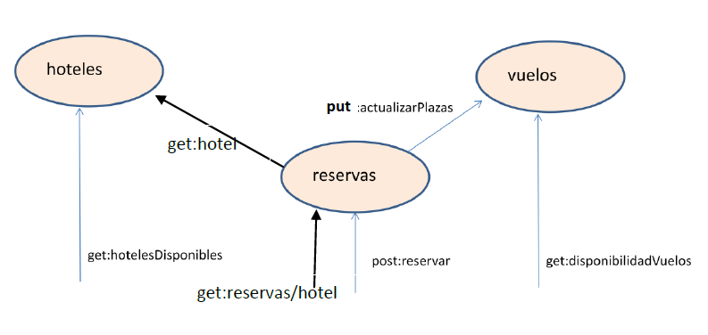

# Proyecto agencia

## Descripcion
Se pretende crear una aplicación para una agencia de viajes, basada en microservicios.
En el backend, la aplicación constará de tres microservicios que accederán a una base de datos. Se trata de los microservicios de hotel, vuelos y reservas 

## Tecnologias utilizadas

***Java 8***

***Spring boot version 2.7.6***

***Swagger version version 2.9.2***

***Mysql***

## Esquema

